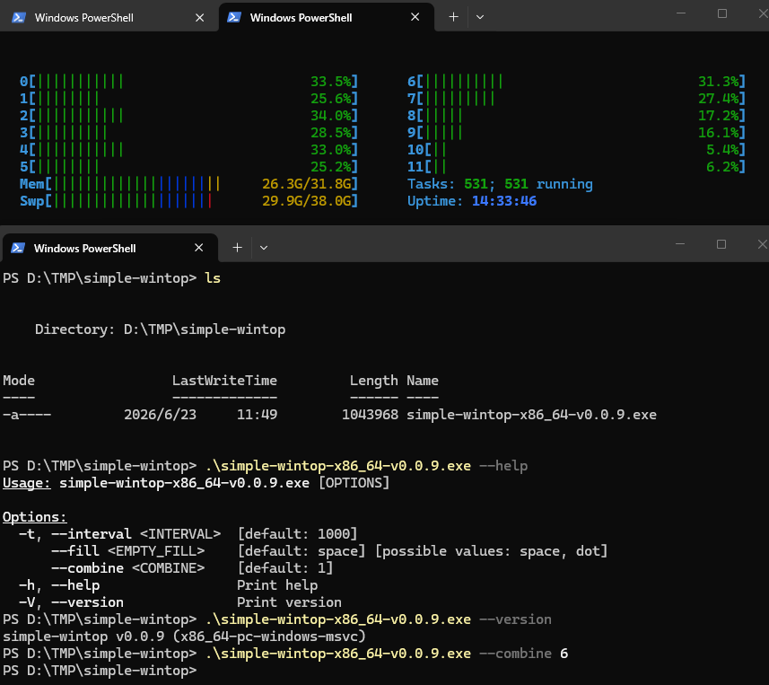

# 🖥️ simple-wintop 🦀

[](https://github.com/VincentZyuApps/simple-wintop/releases)
[](https://scoop.sh/#/apps?q=%22https%3A%2F%2Fgithub.com%2FVincentZyuApps%2Fscoop-bucket%22&o=false)

> 🌟 A lightweight, real-time **system monitor dashboard** for Windows — inspired by [htop](https://github.com/htop-dev/htop) 🚀
> Purely the **top meters section** — CPU bars 🧠, Memory & Swap usage 🫧, Tasks counter 🔢, and Uptime ⏱ — all in a beautiful multi‑color TUI 🎨.

> **[📖 English](readme.md)**
> **[📖 简体中文](readme.zh-cn.md)**

## ✨ Highlights

- 📊 **CPU meters** — per‑core usage bars with green→yellow→red gradient for low→high load 🟢🟡🔴
- 🧠 **Memory & Swap** — real‑time usage bars with multi‑color segments (green → blue → yellow → red) 🟦🟨
- 🔢 **Tasks counter** — total processes and running count at a glance 🔄
- ⏳ **Uptime** — system uptime since last boot 🕒
- ⌨️ **Keyboard shortcuts** — `q` / `Esc` to quit, instant and responsive 🎯
- 🎨 **Colorful TUI** — powered by [ratatui](https://github.com/ratatui-org/ratatui) + [crossterm](https://github.com/crossterm-rs/crossterm) ✨
- 🪟 **Windows only** — built natively for x86_64 and ARM64 🏗️

## 🖼️ Screenshot



## 🚀 Quick Start

```bash
# 📖 Show help
simple-wintop --help
# 🎯 Default dashboard — CPU, Memory, Swap, Tasks, Uptime
simple-wintop
# ⏱️ Set custom refresh interval (in milliseconds)
simple-wintop -t 500
# ℹ️ Show version
simple-wintop --version
```

## ⚙️ Common Flags

| Flag | Description |
|------|-------------|
| `-t, --interval <ms>` | Refresh interval in milliseconds (default: 1000) |
| `--help` | Print help message |
| `--version` | Print version info |

### ⌨️ Keyboard Shortcuts

| Key | Action |
|-----|--------|
| `q` / `Q` / `Esc` | 🚪 Quit |

## 📦 Installation

### Windows (Scoop)
> 📄 [Scoop Bucket](https://github.com/VincentZyuApps/scoop-bucket/blob/main/bucket/simple-wintop.json)
```powershell
scoop bucket add vincentzyu https://github.com/VincentZyuApps/scoop-bucket
scoop update
scoop install simple-wintop
```

### 📥 Manual Download
Download the latest binary from [GitHub Releases](https://github.com/VincentZyuApps/simple-wintop/releases) — choose `simple-wintop-x86_64-v0.x.x.exe` (64-bit) or `simple-wintop-arm64-v0.x.x.exe` (ARM64).

## 🔧 Build from Source

```bash
cargo build --release
```

GitHub Actions automatically builds **Windows x86_64** and **Windows ARM64** binaries.

## 📦 Tech Stack

| Package | Version | Description |
|:---|:---|:---|
| [](https://www.rust-lang.org/) | stable | Programming language |
| [](https://github.com/ratatui-org/ratatui) | 0.29 | Terminal UI framework |
| [](https://github.com/crossterm-rs/crossterm) | 0.28 | Cross-platform terminal library |
| [](https://github.com/GuillaumeGomez/sysinfo) | 0.32 | System information library |
| [](https://github.com/clap-rs/clap) | 4 | Command-line argument parser |
| [](https://github.com/unicode-rs/unicode-width) | 0.2 | Unicode text width |

## 📄 License

📝 [MIT](LICENSE)
